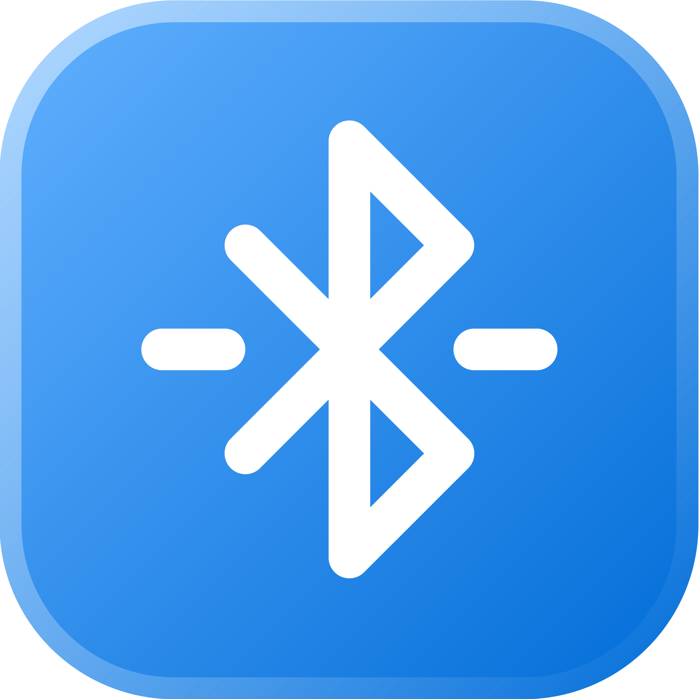

  
  <h1 align="center">Bluetooth</h1>

  

[This extension](https://github.com/VladCuciureanu/RaycastBluetooth) lets you control your Bluetooth devices with a few keystrokes. 
Connecting to your Bluetooth devices <!--and changing your AirPods' noise-cancelling profile -->has never been faster :)

<!--  -->

## Getting Started

Visit this extension's [store page](https://www.raycast.com/vladinski/bluetooth) to get started. 
After installing, follow the instructions on screen, and you should be good to go!

## Feedback

A lot of workarounds were used to implement many of the core functionalities. Not to mention that this extension was also a whim project. So, I would be happy to hear what you think of it and how it could be improved upon. That said, please use GitHub's issues (they're more visible to me and easier to manage). I have a few [templates](https://github.com/raycast/extensions/issues/new/choose) that should help you get started :)
